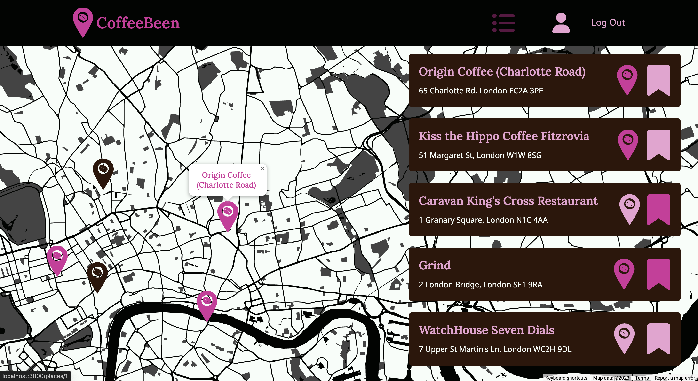
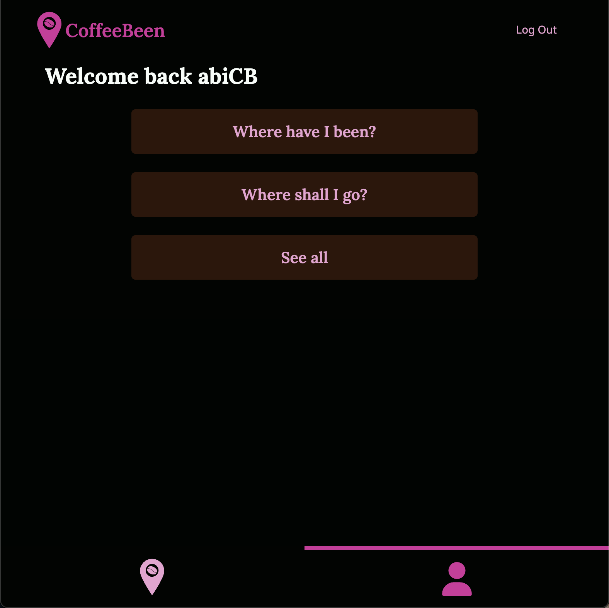
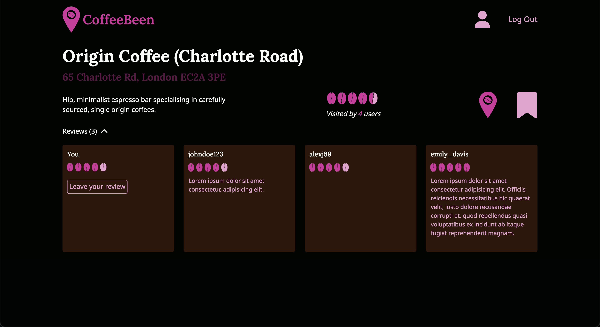

# CoffeeBeen

## Overview

Discover the world of coffee in London!
The place to go for finding speciality coffee in London. Visualise the best coffee shops on a map, or in list view, keep track of where you've visited and where you'd like to go next, and give them a rating & review.

### Problem

For people who love speciality and independent coffee, it can be hard to discover new places, keep track of the places you love and want to try - and have fun while doing it!

### User Profile

The app is for coffee lovers or those who want to discover more. They may want to find good coffee in a certain part of the city or simply keep a note of the best places they've been.

### Features

- FIND coffee shops - use the app's map to see great coffee shops and where they are
- TRACK the spots you've visited and would like to visit
- RATE them - give a review and a rating on our 1-5 coffee bean scale

## Implementation

### Tech Stack

#### Front End:

- React
- HTML
- CSS/Sass
- JavaScript
- Axios

#### Back End:

- Node.js
- Express.js
- MySQL
- Knex.js

#### Additional Libraries:

- jsonwebtoken
- bcrypt
- dotenv
- @react-google-maps/api
- @smastrom/react-rating

### APIs

- Google Maps API
- Database of coffee shops, users and visits (with ratings, reviews and wishlists)

### Sitemap

- Homepage - displays all coffee shops in map view or list view. Indicates which have been visited by the user.
- Individual page for each coffee shop with details, ratings, reviews and user visits.
- User Profile page - a user can view the list of coffee shops they've visited and their wishlist of coffee shops to visit.
- Login/Sign up page - users must sign up and log in before saving coffee shops, but they can see all coffee shops on the map and in the list view.

### Installation Instructions

- Download both the client and server side code.
- Open server code in software such as VSCode
- Use .env.sample file to create .env file in base folder for the back end, which holds the database name, username & password, the port number and JWT key for auth.
- Once set up, in the terminal run `npm install`
- Create MySQL CoffeeBeen database as named in .env file.
- Migrate database tables with `npm run db:migrate`
- Seed data into tables with `npm run db:seed`
- Get server running with `npm start`
- Open client side code in software such as VSCode, use .env.sample file to create .env file in base folder for Google API Key and Server Base URL, with the same port as set up in the server.
- Once .env file is set up, in the terminal run `npm install`
- To get the app going, run `npm start`

### Screenshots

### Data

## Future features and changes

- UNLOCK achievements as you go - the more places you visit the more you gain!
- ADD your own - Got places you love or want to try? Add them to your profle.
- Location services - check in at coffee shops for extra achievements/rewards, find places close to where you are, AR featues unlocked on check in.
- Add friends - see where your friends have visited, comment/message/interact with them, some sort of leaderboard, see other's reviews. Like Strava for coffee drinkers!
- Improvements to map UI with better zooming & centering.
