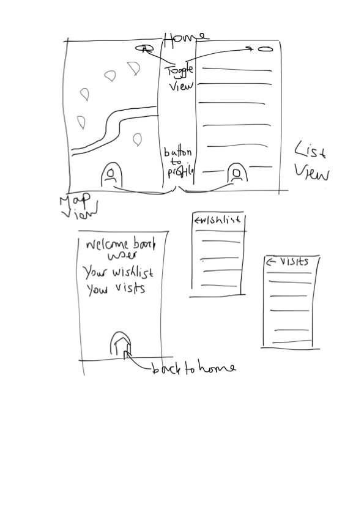
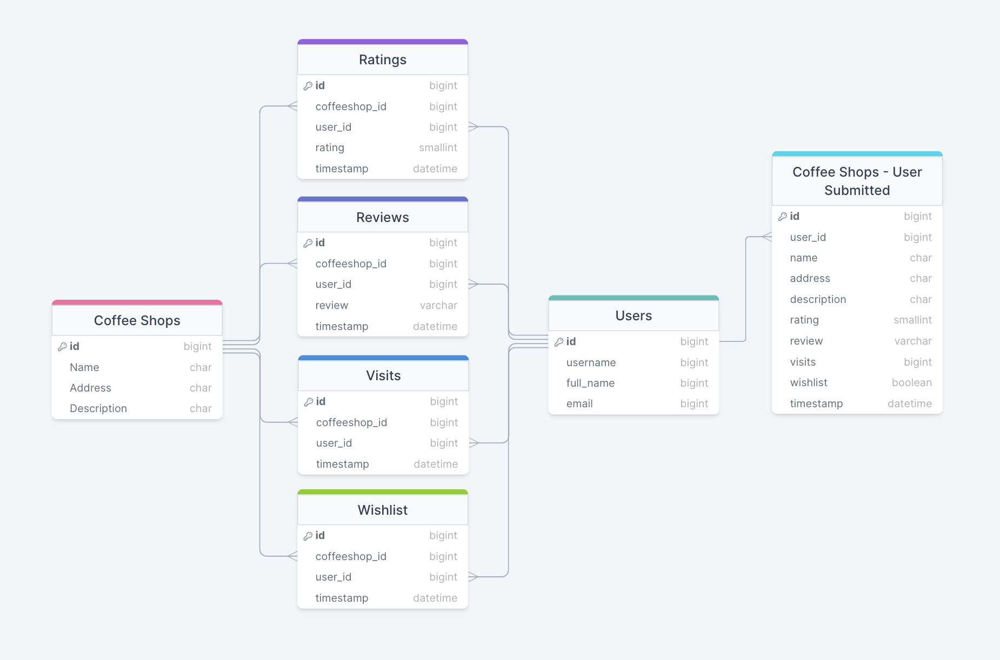

# CoffeeBeen

## Overview

Discover the world of coffee in London!
The place to go for finding speciality coffee in London. Visualise the best coffee shops on a map, or in list view, keep track of where you've visited and where you'd like to go next, and give them a rating & review.

### Problem

For people who love speciality and independent coffee, it can be hard to discover new places, keep track of the places you love and have fun while doing it!

### User Profile

The app is for coffee lovers or those who want to discover more. They may want to find good coffee in a certain part of the city or simply keep a note of the best places they've been.

### Features

- FIND coffee shops - use the app's map or list function to see great coffee shops and where they are
- TRACK the spots you've visited - like a scratch map or sticker collection
- RATE them - give a review and a rating on our 1-5 coffee bean scale

## Implementation

### Tech Stack

#### Front End:

- React
- HTML
- CSS/Sass
- JavaScript
- Axios

#### Back End:

- Node.js
- Express.js
- MySQL
- Knex.js

#### Other:

- Babel
- Postman
- Git & GitHub
- NPM

### APIs

- Google Maps API
- Database of coffee shops, users, rating, reviews, visits and wishlists

### Sitemap

- Homepage - displays all coffee shops in map view or list view. Indicates which have been visited by the user.
- Individual page for each coffee shop with details, ratings, reviews and user visits. Will also display user specific data such as "You vistied this coffee shop on 12th November 2023".
- User Profile page - a user can view their stats, see the list of coffee shops they've visited, reviewed and rated and their wishlist of coffee shops to visit.
- User wishlist page - shows coffee shops user has indicated they'd like to visit
- User visited page - shows coffee shops user has visited with their rating and review

### Mockups

### Data

> User Submitted Coffee Shops is a _nice to have_ feature

### Endpoints

**GET** for all coffee shops
 &nbsp;&nbsp;&nbsp;&nbsp;&nbsp;Example response :
 &nbsp;&nbsp;&nbsp;&nbsp;&nbsp;{ coffeeshop_id,
 &nbsp;&nbsp;&nbsp;&nbsp;&nbsp;&nbsp;&nbsp;name,
 &nbsp;&nbsp;&nbsp;&nbsp;&nbsp;&nbsp;&nbsp;address,
 &nbsp;&nbsp;&nbsp;&nbsp;&nbsp;&nbsp;&nbsp;average rating }

**GET** coffee shop details
 (parameters: coffee shop ID)
 &nbsp;&nbsp;&nbsp;&nbsp;&nbsp;Example response :
 &nbsp;&nbsp;&nbsp;&nbsp;&nbsp;{ coffeeshop_id,
 &nbsp;&nbsp;&nbsp;&nbsp;&nbsp;&nbsp;&nbsp;name,
 &nbsp;&nbsp;&nbsp;&nbsp;&nbsp;&nbsp;&nbsp;address,
 &nbsp;&nbsp;&nbsp;&nbsp;&nbsp;&nbsp;&nbsp;description,
 &nbsp;&nbsp;&nbsp;&nbsp;&nbsp;&nbsp;&nbsp;average rating,
 &nbsp;&nbsp;&nbsp;&nbsp;&nbsp;&nbsp;&nbsp;review count,
 &nbsp;&nbsp;&nbsp;&nbsp;&nbsp;&nbsp;&nbsp;visit count }

**GET** all reviews for a coffee shop
 (parameters: coffee shop ID)
 &nbsp;&nbsp;&nbsp;&nbsp;&nbsp;Example response :
 &nbsp;&nbsp;&nbsp;&nbsp;&nbsp;{ review_id,
 &nbsp;&nbsp;&nbsp;&nbsp;&nbsp;&nbsp;&nbsp;coffeeshop_id,
 &nbsp;&nbsp;&nbsp;&nbsp;&nbsp;&nbsp;&nbsp;coffeeshop_name,
 &nbsp;&nbsp;&nbsp;&nbsp;&nbsp;&nbsp;&nbsp;user_id,
 &nbsp;&nbsp;&nbsp;&nbsp;&nbsp;&nbsp;&nbsp;username,
 &nbsp;&nbsp;&nbsp;&nbsp;&nbsp;&nbsp;&nbsp;review,
 &nbsp;&nbsp;&nbsp;&nbsp;&nbsp;&nbsp;&nbsp;timestamp }

**POST** review for a coffee shop
 (parameters: coffee shop ID, user ID, review object)
 &nbsp;&nbsp;&nbsp;&nbsp;&nbsp;Example response :
 &nbsp;&nbsp;&nbsp;&nbsp;&nbsp;{ review_id,
 &nbsp;&nbsp;&nbsp;&nbsp;&nbsp;&nbsp;&nbsp;coffeeshop_id,
 &nbsp;&nbsp;&nbsp;&nbsp;&nbsp;&nbsp;&nbsp;user_id,
 &nbsp;&nbsp;&nbsp;&nbsp;&nbsp;&nbsp;&nbsp;review }

**POST** rating for a coffee shop
 (parameters: coffee shop ID, user ID, rating object)
 &nbsp;&nbsp;&nbsp;&nbsp;&nbsp;Example response :
 &nbsp;&nbsp;&nbsp;&nbsp;&nbsp;{ rating_id,
 &nbsp;&nbsp;&nbsp;&nbsp;&nbsp;&nbsp;&nbsp;coffeeshop_id,
 &nbsp;&nbsp;&nbsp;&nbsp;&nbsp;&nbsp;&nbsp;user_id,
 &nbsp;&nbsp;&nbsp;&nbsp;&nbsp;&nbsp;&nbsp;rating }

**POST** visit for a coffee shop
 (parameters: coffee shop ID, user ID)
 &nbsp;&nbsp;&nbsp;&nbsp;&nbsp;Example response :
 &nbsp;&nbsp;&nbsp;&nbsp;&nbsp;{ visit_id,
 &nbsp;&nbsp;&nbsp;&nbsp;&nbsp;&nbsp;&nbsp;coffeeshop_id,
 &nbsp;&nbsp;&nbsp;&nbsp;&nbsp;&nbsp;&nbsp;user_id }

**PATCH** to update whether a coffee shop is on a user's wishlist
 (parameters: coffee shop ID, user ID, wishlist object/boolean)
 &nbsp;&nbsp;&nbsp;&nbsp;&nbsp;Example response :
 &nbsp;&nbsp;&nbsp;&nbsp;&nbsp;{ wishlist_id,
 &nbsp;&nbsp;&nbsp;&nbsp;&nbsp;&nbsp;&nbsp;coffeeshop_id,
 &nbsp;&nbsp;&nbsp;&nbsp;&nbsp;&nbsp;&nbsp;user_id,
 &nbsp;&nbsp;&nbsp;&nbsp;&nbsp;&nbsp;&nbsp;on_wishlist }

**PATCH** to edit user's own rating or review
 (parameters: coffee shop ID, user ID)
 &nbsp;&nbsp;&nbsp;&nbsp;Example response :
 &nbsp;&nbsp;&nbsp;&nbsp;{ rating_id,
 &nbsp;&nbsp;&nbsp;&nbsp;&nbsp;&nbsp;coffeeshop_id,
 &nbsp;&nbsp;&nbsp;&nbsp;&nbsp;&nbsp;user_id,
 &nbsp;&nbsp;&nbsp;&nbsp;&nbsp;&nbsp;rating }
 or
 &nbsp;&nbsp;&nbsp;&nbsp;{ review_id,
 &nbsp;&nbsp;&nbsp;&nbsp;&nbsp;&nbsp;coffeeshop_id,
 &nbsp;&nbsp;&nbsp;&nbsp;&nbsp;&nbsp;user_id,
 &nbsp;&nbsp;&nbsp;&nbsp;&nbsp;&nbsp;review }

**DELETE** user's own rating or review
 (parameters: coffee shop ID, user ID)
 No response

**GET** user's wishlist or visited list
 (parameters: user ID)
 &nbsp;&nbsp;&nbsp;&nbsp;Example response:
 &nbsp;&nbsp;&nbsp;&nbsp;{ used_id,
 &nbsp;&nbsp;&nbsp;&nbsp;&nbsp;&nbsp;coffeeshop_id,
 &nbsp;&nbsp;&nbsp;&nbsp;&nbsp;&nbsp;coffeeshop_name,
 &nbsp;&nbsp;&nbsp;&nbsp;&nbsp;&nbsp;address,
 &nbsp;&nbsp;&nbsp;&nbsp;&nbsp;&nbsp;average_rating }
 or
 &nbsp;&nbsp;&nbsp;&nbsp;{ used_id,
 &nbsp;&nbsp;&nbsp;&nbsp;&nbsp;&nbsp;coffeeshop_id,
 &nbsp;&nbsp;&nbsp;&nbsp;&nbsp;&nbsp;coffeeshop_name,
 &nbsp;&nbsp;&nbsp;&nbsp;&nbsp;&nbsp;address,
 &nbsp;&nbsp;&nbsp;&nbsp;&nbsp;&nbsp;user_rating,
 &nbsp;&nbsp;&nbsp;&nbsp;&nbsp;&nbsp;user_review }

### Auth

Some data and parts of the UI will be user specific, so some form of login/profile functionality will be necessary.

## Roadmap

- Set up server
- Set up database with sample coffee shop data
- Create end points for the HTTP methods
- Set up React app
- Create homepage functionality, linking up to API
- Create homepage styling with Google Maps API
- Create individual coffee shop pages, linking up to API, & styling
- Create user profile page, linking up to API, & styling
- Create user wishlist, linking up to API, & styling
- Create user visited list, linking up to API, & styling

## Nice-to-haves

- UNLOCK achievemnts as you go - the more places you visit the more you gain!
- ADD your own - Got places you love or want to try? Add them to your profle.
- Location services - check in at coffee shops for extra achievements/rewards, find places close to where you are, AR featues unlocked on check in.
- Add friends - see where your friends have visited, comment/message/interact with them, some sort of leaderboard, see other's reviews. Like Strava for coffee drinkers!
- Earn points & discounts to use in store, QR code to scan and earn achievements when you buy something in store
- Check user submitted entries and add to core database
- Scratch map/sticker book design for achievements
